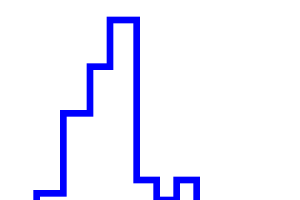

# Rapport TP1 ACT

Gaspar Henniaux - Marwane Ouaret

## 1 

### 1.1 

- On a une ligne oblique quand on passe du point (2, 5) au pont (4, 4) ce n'est donc pas une ligne de toit.
- De même entre les points (2, 0) et (1, 4).
- Pour la troisième polyligne on a une ligne de toit car tous les traits son verticaux ou horizontaux.
- Les couples (6, 7) et (5, 0) forment un traits oblique.
- Pour la cinquième polyligne on a pas de ligne de toi car tous les traits sont verticaux ou horizontaux mais on note tout de même qu'il y a un pic entre le points (4, 8) et(4, 7), il n'y a pas de "plafond".

### 1.2

pour une liste de couples, (c0, ..., cn) soit un couple cx et cx+ tq x pair alors ces 2 couples sont de formats (A , B) (A , C) (inversement si impair).

### 1.3

Soit une liste de couples, (c0, ..., cn)Pour passer de l'écriture brute à l'écriture compacte il suffit de supprimer chaque couple de numero pair




## 2

```
N : nombre d'immeuble
L : liste de triplet de la forme (g, h, d)
H : h max
D : d max

initialiser la matrice M selon H et D à false
pour i allant de 0 à N :
    pour j allant de 0 à L[i][1]:
         pour k allant de L[i][0] à L[i][2]:
            M[j, k] -> True
dessiner la ligne  (complexité : O(H*D))

```

compléxité : O(N*H*D)

désavantages : on passe des "pixels" à true plusieurs fois, 

## 3

```
N : nombre d'immeuble
L : liste de triplet de la forme (g, h, d)
H : h max
D : d max


```

## 4

```
L1 : liste1 de points compacts
L2 : liste2 de points compacts

i1 = 0 (indice de L1)
i2 = 0 (indice de L2)

L = []
currentH = 0
D = 0

Tant que i1 < len(L1) ou i2 < len(L2) :
    Si L1[i1][0] < L2[i2][0] :
        L.append(L1[i1])
        currentH = L1[i1][1]
        D = L1[i1+1][0] 
        i1 += 1
    Sinon :
        si L1[i1][0] > L2[i2][0] :
            L.append(L2[i2])
            currentH = L2[i2][1]
            D = L2[i2+1][0] 
            i2 += 1
        Sinon :
            si L1[i1][1] > L2[i2][1] :
                L.append(L1[i1])
                currentH = L1[i1][1]
                D = L1[i1+1][0]
                i1 += 1
            Sinon :
                L.append(L2[i2])
                currentH = L2[i2][1]
                D = L2[i2+1][0]
                i2 += 1

```

    

