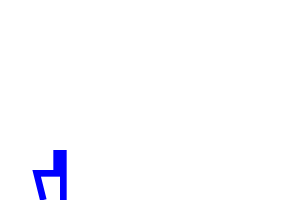
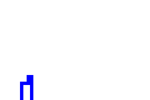
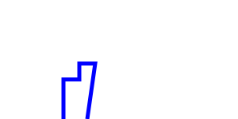
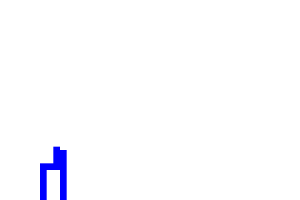

# Rapport TP1 ACT

Gaspar Henniaux - Marwane Ouaret

## 1 

### 1.1 

— (2, 0)(2, 5)(4, 4)(4, 7)(5, 7)(5, 0)

- On a une ligne oblique quand on passe du point (2, 5) au point (4, 4) ce n'est donc pas une ligne de toit.

— (2, 0)(1, 4)(4, 4)(4, 7)(5, 7)(5, 0)

- De même entre les points (2, 0) et (1, 4).

— (2, 0)(2, 5)(4, 5)(4, 7)(5, 7)(5, 0)

- Pour la troisième polyligne on a une ligne de toit car tous les traits sont verticaux ou horizontaux.

— (2, 0)(2, 5)(4, 5)(4, 7)(5, 7)(6, 7)(5, 0)

- Les couples (6, 7) et (5, 0) forment un trait oblique.

— (2, 0)(2, 5)(4, 5)(4, 8)(4, 7)(5, 7)(5, 0)

- Pour la cinquième polyligne on n'a pas de ligne de toit car tous les traits sont verticaux ou horizontaux mais on note tout de même qu'il y a un pic entre les points (4, 8) et (4, 7), il n'y a pas de "plafond".

### 1.2

pour une liste de couples, (C0, ..., Cn) soit un couple Cx et Cx+1 tel que x pair alors ces 2 couples sont de formats (A , B) (A , C) (inversement si impair (A, B) (C, B)).

### 1.3

Soit une liste de couples, (c0, c1, c2 ..., cn) Pour passer de l'écriture brute à l'écriture compacte il suffit de supprimer chaque couple de numero impair de la liste. (c0, c2, c4, ..., cn)


## 2

```
N : nombre d'immeuble
L : liste de triplet de la forme (g, h, d)
H : h max
D : d max

initialiser la matrice M selon H et D à false
pour i allant de 0 à N : (complexité : O(n))
    pour j allant de 0 à L[i][1]: (complexité : O(h))
         pour k allant de L[i][0] à L[i][2]: (complexité : O(d))
            M[j, k] -> True
dessiner la ligne  (complexité : O(H*D))

```

### compléxité : 

La complexité de cette fonction est en O(n * h * d) avec n le nombre d'immeubles, h la hauteur maximale et d la distance maximale. En effet, pour chaque immeuble on parcourt h lignes et d colonnes pour mettre à True les cases de la matrice M correspondant à l'immeuble.

désavantages : On ne garde pas en mémoire les "pixels" déjà passés à true. On peut donc avoir des doublons dans la matrice M. 

## 3

```
Li : ligne de toit
N : nombre d'immeuble
L : liste de triplet de la forme (g, h, d)
H : h max
D : d max

Li = []
Pour i=0 à N                               O(N)
    Li = ajouter_immeuble(Li, L[i])         O(N)


ajouter_immeuble(Li, [g,h,d] ){ 
    rep = []
    test = 0
    i = 0

    Si Li vide
        alors ajouter (g,h)(d,0) à rep
    
    sinon 
        Pour chaque segment (x1, y1) (x2,y2) dans Li
        
            si g >= x2 ou d =< x1
                alors si i == 0
                    alors ajouter (x1, y1) (x2,y2) à rep
                sinon ajouter (x2,y2) à rep
                Si test ==  0
                    test = 1
            sinon
                test = 2

                si x1 <= g et x2 >= d
                    si h > y1
                        si i == 0
                            alors ajouter (x1, y1) (g,h) (d, y1) (x2, y2) à rep
                        sinon
                            alors ajouter  (g,h) (d, y1) (x2, y2) à rep  
                    sinon
                        si i == 0 
                            ajouter (x1,y1) (x2,y2) à rep
                        sinon 
                            œajouter (x2,y2) à rep


                sinon si x1 => g et x2 <= d
                    si h < y1
                        si i == 0 
                            ajouter (g, h) (x1, y1) (x2 , h) (d, 0) à rep
                        sinon
                            retirer dernier element de rep
                            ajouter (g, h) (x1, y1) (x2 , h) (d, 0) à rep
                    sinon 
                        si i == 0 
                            ajouter (g,h)(d,0) à rep
                        sinon
                            retirer dernier element de rep
                            ajouter (g,h)(d,0) à rep


                sinon si x1 <= g et x2 <= d
                    si h > y1
                        si i == 0 
                            alors ajouter (x1, y1) (g,h) (d, 0) à rep
                        sinon
                            ajouter  (g,h) (d, 0) à rep
                    sinon 
                        si i == 0 
                            ajouter (x1,y1) (x2,h) (d, 0) à rep
                        sinon
                            ajouter (x2,h) (d, 0) à rep


                sinon si x1 >= g et x2 >= d
                    si h > y1
                        alors ajouter (g, h) (d,y1) (x2, y2) à rep
                    sinon 
                        ajouter (g,h) (x1,y1) (x2, y2) à rep
            i++

    Si test = 1
        ajouter (g,h)(d,0) à rep

    Supprimer doublon cote à cote dans rep ainsi que les couples de format (x ,y1) (x, y2) et garder celui dont la valeur y est la plus grandeO(n)
                    
    return rep  
}

```

### complexité :

La fonction ajouter immeuble étant O(n) car dans le pire des cas à au dernier appel de cette fonction la boucle fera  autant d'itérations  qu'il y a d'immeubles, 

La suppression de doublon étant O(n) alors la fonction ajouter immeuble est O(n + n) soit 0(2n) -> O(n)

Cette fonction étant appelé N fois pour inserer tous les immeubles alors le programme est O(n*n), soit O(n²)


## 4

```
fonction merge_roof_line(l1, l2)
    i1 = 0
    i2 = 0
    h1 = 0
    h2 = 0
    d = 0
    hMax = 0
    merged = liste vide

    tant que i1 est inférieur à longueur de l1 et i2 est inférieur à longueur de l2 :
        si l1[i1][0] < l2[i2][0] :
            d = l1[i1][0]
            h1 = l1[i1][1]
            hMax = maximum entre h1 et h2
            i1 += 1
        sinon :
            si l1[i1][0] > l2[i2][0] :
                d = l2[i2][0]
                h2 = l2[i2][1]
                hMax = maximum entre h1 et h2
                i2 += 1
            sinon :
                d = l1[i1][0]
                h1 = l1[i1][1]
                h2 = l2[i2][1]
                hMax = maximum entre h1 et h2
                i1 += 1
                i2 += 1

        si merged est vide ou hMax est différent du dernier élément de merged :
            ajouter (d, hMax) à merged

    ajouter le reste de l1[i1:] à merged
    ajouter le reste de l2[i2:] à merged

    retourner merged
```

voici le code en python : 

```python
def merge_roof_line(l1, l2):
    i1 = 0
    i2 = 0
    h1 = 0
    h2 = 0
    d = 0
    hMax = 0
    merged = []

    while i1 < len(l1) and i2 < len(l2):
        if l1[i1][0] < l2[i2][0]:
            d = l1[i1][0]
            h1 = l1[i1][1]
            hMax = max(h1, h2)
            i1 += 1
        else:
            if l1[i1][0] > l2[i2][0]:
                d = l2[i2][0]
                h2 = l2[i2][1]
                hMax = max(h1, h2)
                i2 += 1
            else:
                d = l1[i1][0]
                h1 = l1[i1][1]
                h2 = l2[i2][1]
                hMax = max(h1, h2)
                i1 += 1
                i2 += 1

        if len(merged) == 0 or hMax != merged[-1][1]:
            merged.append((d, hMax))

    merged += l1[i1:]
    merged += l2[i2:]

    return merged
```

### complexité :

Ici la boucle principale est une boucle tant que qui s'arrete lorsque i1 ou i2 est supérieur à la longueur de l1 ou l2. Or à chaque itération de cette boucle on incrémente i1 ou i2 ou les deux de 1. Donc la boucle s'execute au maximum n fois (n étant la longueur de l1 ou l2). Donc la complexité de cette fonction est O(n) avec n la longueur de l1 ou l2.


## 5

```
fonction divide_roof_line(liste l)
    si la longueur de l est égale à 1 :
        retourner l[0]
    sinon :
        partie_gauche = divide_roof_line(l[:longueur(l)//2])
        partie_droite = divide_roof_line(l[longueur(l)//2:])
        retourner merge_roof_line(partie_gauche, partie_droite)

fonction building_to_roof_line(liste l)
    roofs = liste vide

    pour i de 0 à longueur(l) - 1 :
        roof = liste vide
        ajouter (l[i][0], l[i][1]) à roof
        ajouter (l[i][2], 0) à roof
        ajouter roof à roofs

    retourner divide_roof_line(roofs)
```

voici le code en python : 

```python
def divide_roof_line(l):
    if len(l) == 1:
        return l[0]
    else:       
        return merge_roof_line(divide_roof_line(l[:len(l)//2]), divide_roof_line(l[len(l)//2:]))
    
def building_to_roof_line(l):
    roofs = []
    for i in range(len(l)):
        roof = []
        roof.append((l[i][0], l[i][1]))
        roof.append((l[i][2], 0))
        roofs.append(roof)
    return divide_roof_line(roofs)
```

### complexité :

La fonction `building_to_roof_line` est en O(n) avec n la longueur de la liste l. En effet, la boucle for s'execute n fois (n étant la longueur de l). Cette fonction ne s'éxecute qu'une seule fois.

Les appels récursifs de la fonction `divide_roof_line` s'arrêtent lorsque la longueur de la liste passée en paramètre est égale à 1. Or à chaque appel récursif, la liste passée en paramètre est divisée par 2. Donc le nombre d'appels récursifs est en O(log(n)) avec n la longueur de la liste l.

Donc la complexité de la fonction `building_to_roof_line` est en O(n + n*log(n)) = O(n*log(n)) avec n la longueur de la liste l.


    

