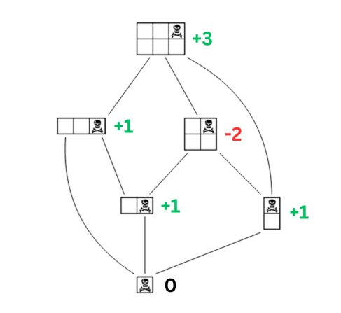
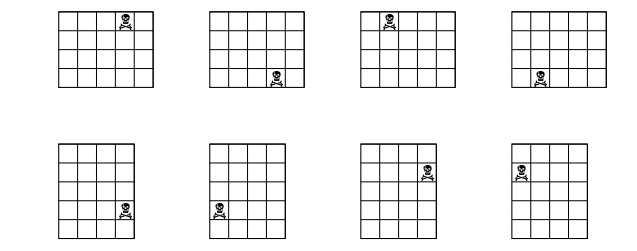

# Rapport TP2 ACT

Gaspar Henniaux - Marwane Ouaret

Lien Github : <https://github.com/pargass/ACT-TP/tree/main/tp2>

## Question 1

Pour définir une grille de manière unique il faut le nombre de lignes, le nombre de colonnes et les coordonnées de la case piégée

## Question 2



On considère que la configuration de base est une tablette de taille 1 x 1 avec comme unique case restante le carré de la mort et a pour valeur 0.

Ensuite chaques successeurs direct du cas de base prennent pour valeur 1 car il leur suffit de couper une fois pour gagner.

Pour les cases n'ayant pas de lien avec le cas de base, on recupère la valeur du successeur qui mennent au chemin le plus long, on ajoute 1 si il est positif (inversement -1 si négatif), puis on multiplie par -1.

## Question 3

Etant donnée une configuration (m, n, i, j), pour obtenir tous ses successeurs on peut appliquer les règles suivantes :

- ∀ k tel que 0<k<i+1;  (m-k, n, i-k , j) 
- ∀ k tel que i<k<m;    (k, n, i , j) 
- ∀ k tel que 0<k<j+1;  (m, n-k, i , j-k) 
- ∀ k tel que j<k<n;    (m, k, i , j) 

## Question 4

Pour calculer la valeur d'une configuration à partir des valeurs de ses successeurs, on peut appliquer la formule suivante :

- si parmis les successeurs il y a des valeurs négatives, alors la valeur de la position s'obtient en prenant la valeur absolue de la plus haute valeur négative et d'ajouter 1
- sinon, la valeur de la position s'obtient en prenant l'oppoée de la plus haute valeur positive et d'enlever 1 (dans l'idée de retarder la défaite au maximum)

Formule mathématique : 

Soit v(P) avec pour ensemble de successeurs  S = \{ s_1, s_2, ... , s_n \}.


## Question 5

```
function position_value(m, n, i, j):
    si il ne reste qu'une case alors
        return 0
    sinon
        valeur_successeurs = valeur de tous les successeurs de la position (m, n, i, j)
        si il y a des valeurs négatives dans valeur_successeurs ou 0 alors
            return abs(valeur négative la plus haute) + 1
        sinon
            return -valeur positive la plus haute - 1
```

## Question 6

Pour la configuration (10, 7, 7, 3), le temps d'exécution est de 192 secondes tandis que pour la configuration (10, 7, 5, 3) le temps d'exécution est de 414 secondes

## Question 7

Cette différence s'explique par le fait que dans le second cas plein de positions sont recalculée plusieurs fois, ce qui n'est pas le cas dans le premier cas

la complexité de cet algorithme est exponentielle car dans la boucle principale on appelle la fonction position_value m + n - 2 fois

## Question 8

Nous avons décidés de choisir un dictionnaire pour stocké les valeures déjà caculées. On met en clé les configurations sous forme de tuple et en valeur la valeur de la configuration.

Initalement nous avions hesité entre un dictionnaire et un array, les deux choix avait chacuns leurs avantages et inconvénients :

- Le dictionnaire permet de prendre moins d'espace car nous rentrons comme clé uniquement les configurations que nous calculons. Cependant lorsque l'on fait appelle à une valeur dans le dictionnaire, cette appel ce fait en O(n).

- Le tableau lui permet de récupèrer les valeurs stocker en temps constant O(1) mais ce dernier prend enormement de place car toutes les configurations existantes prennent une case dans le tableau.

En prennant en compte ces contraintes, nous avons prefèré choisir une méthode de stockage qui prendra un peu plus de temps mais qui ne saturera pas la mémoire en cas de grosse valeures de configuration.

```
memo = {}

fonction position_values_dynamique(m, n, i, j):
    etat = (m, n, i, j)

    si etat dans memo:
        return memo[etat]

    si il ne reste qu'une case alors
        return 0
    sinon
        valeur_successeurs = valeur de tous les successeurs de la position (m, n, i, j) #appelle de la fonction position_values_dynamique m + n - 2 fois
        si il y a des valeurs négatives dans valeur_successeurs ou 0 alors
            res =  abs(valeur négative la plus haute) + 1
        sinon
            res =  -valeur positive la plus haute -1

    on stock la valeur res de etat dans memo
    return res
```

## Question 9

Pour la configuration (100,100,50,50), la valeur est -198 et la confirguration (100,100,48,52), la valeur est 191.

## Question10

Les configurations possibles pour obtenir la valeur 127 dans une tablette de taille (127, 127) sont (127,127,i,j) tel que (i,j) :

- **(0,63)**
- **(63,0)**
- **(126, 63)**
- **(63, 126)**

## Question 11

La complexité de notre algorithme dynamique est en O(mn) car :
- Pour obtenir valeur successeur on fait appelle recursivement à la fonction position_values_dynamique() m + n - 2 fois (le nombre de successeurs direct)
- Ensuite chaques successeurs doit refaire là même chose jusqu'au cas de base donc on fait celà m*n fois

A(1,1,0,0) = 0
A(m, n, i, j) = max(A(a,b,c,d) tel que a,b,c,d repésente toutes les successeurs direct) + 1

On obtient donc une complexité O((mn)*(m + n - 2)) => O((mn)*(m+n))

## Question 12



Toutes ces configurations ont la même valeur car il pour une configuration donnée, la valeur reste la même si on fait une rotation de 90°, 180° ou 270° ou si on fait une symétrie horizontal ou vertical

## Question 13

```
acc_memo = {}

fonction normaliser_etat(m, n, i, j):
    si m < n alors
        m, n = n, m
        i, j = j, i
    si i > m / 2 alors
        i = m - i - 1
    si j > n / 2 alors
        j = n - j - 1
    return (m, n, i, j)

fonction acc_valeur_position(m, n, i, j):
    etat = normaliser_etat(m, n, i, j)

    si etat dans acc_memo:
        return acc_memo[etat]

    si m == 1 et n == 1 alors
        return 0

    tableau_valeurs = []
    pour chaque position dans configurations_possibles(m, n, i, j):
        position_normalisee = normaliser_etat(*position)
        ajouter acc_valeur_position(*position_normalisee) à tableau_valeurs

    si min(tableau_valeurs) <= 0 alors
        valeurs_negatives = [v pour v dans tableau_valeurs si v <= 0]
        resultat = abs(max(valeurs_negatives)) + 1
    sinon
        resultat = -max(tableau_valeurs) - 1

    acc_memo[etat] = resultat
    return resultat
```

Oui le temps de résolution diminue grandement.

## Question 14

En ce qui concerne la version accelerer, l'ordre de grandeur est la même chose que la version dynamique mais divisé par 8 dû à la normalisation.

## Question 15

On considère que l'utilisateur rentre que des inputs valides, le code qui gère les mauvaises entrées est disponible sur : <https://github.com/pargass/ACT-TP/tree/main/tp2>

```

joueur = 1 -> ordinateur
joueur = 2 -> humain

function jeu (nb_colonne, nb_ligne, posX_mort, posY_mort, joueur){

    Si le nb_colonne et nb_ligne = 1
        afficher la configuration
        Si joueur est l'oridnateur (1)
            print "Fin du jeu vous avez perdu"
        sinon
            print "Fin du jeu vous avez gagner"
    
    Afficher la configuration

    Si joueur est l'oridnateur (1)
        print "Tour de l'ordinateur"
        configurations = tableau de tous les successeurs directs de la configuration actuelle (fonction possible_configuration)
        choices = tableau vide

        Pour chaque element dans configurations
            mettre dans choices la valeur de la configuration de element (fonction acc_position_value)
        
        Si dans choices la valeur minimal est inferieur ou égale à 0
            index = indice  de choices de la valeur la plus grande inferieurs ou égal à 0
            jeu (*configuration[index], 2) #Donne à l'adversaire la configuration qui permet de perdre en le moins de coup possible
        sinon
            index = indice de choices de la valeur la plus grande
            jeu (*configuration[index], 2) #Donne à l'adversaire la configuration qui permet qu'elle gagne en le plus de coup possible 

    Sinon
        print "Votre tour"
        Si m!=1 et n!=1
            direction = input que l'utilisateur choisi entre h et v (honrizontal et vertical)
        sinon si m==1
            direction = h #car plus possible de couper verticalement
        sinon
            direction = v #car plus possible de couper horizontalement
        
        Si direction == h
            n2 = input de l'utilisateur qui choisit une valeur entre 1 et nb_ligne -1
            SI n2 <= posY_mort
                print "L'évaluation de votre coup est :" acc_position_value(nb_colonne, nb_ligne - n2, posX_mort, posY_mort - n2)
                jeu (nb_colonne, nb_ligne - n2, posX_mort, posY_mort - n2, 1) #Cette configuration permet de décalé la position relative de posY_mort et donner la main à l'ordinateur
            sinon
                print "L'évaluation de votre coup est :" acc_position_value(nb_colonne, n2, posX_mort, posY_mort)
                jeu (nb_colonne, n2, posX_mort, posY_mort) #Cette configuration permet de donner la main à l'adversaire de la coupe choisit

        Si direction == v
            m2 = input de l'utilisateur qui choisit une valeur entre 1 et nb_colonne -1
            SI m2 <= posX_mort
                print "L'évaluation de votre coup est :" acc_position_value(nb_colonne - m2, nb_ligne, posX_mort - m2, posY_mort)
                jeu (nb_colonne - m2, nb_ligne, posX_mort - m2, posY_mort, 1) #Cette configuration permet de décalé la position relative de posX_mort et donner la main à l'ordinateur
            sinon
                print "L'évaluation de votre coup est :" acc_position_value(m2, nb_ligne, posX_mort, posY_mort)
                jeu (m2, nb_ligne, posX_mort, posY_mort) #Cette configuration permet de donner la main à l'adversaire de la coupe choisit
}

```

## Question 16

Nous pensons que les 2 jeux ont beaucoup de ressemblance, par exemple :

- La nature des coups ressemble à une tablette de chocolat de taille (m, 1) avec uniquement des coupes de 1 à 3 autorisés.
- dans les 2 jeu il existe des configurations perdantes et gagnantes. Donc on pourrait représentés les configurations sous forme de graphe comme la question 2.
- Il y aura forcement un gagnant et un perdant, si le joueur ayant la configuration gagnante joue parfaitement, il ne pourra jamais perdre (et inversement)

Il serait donc possible de programmer de la même façon le jeu de nim (version dynamique classique) car la configuration est le nombre de batonnêt, cependant nous pense que choisir un tableau à une dimension comme façon de stocké les valeurs des configurations est plus adapté pour le jeu de nim dûe au fait qu'il n'y a qu'une caracteristique pour une configuration.
