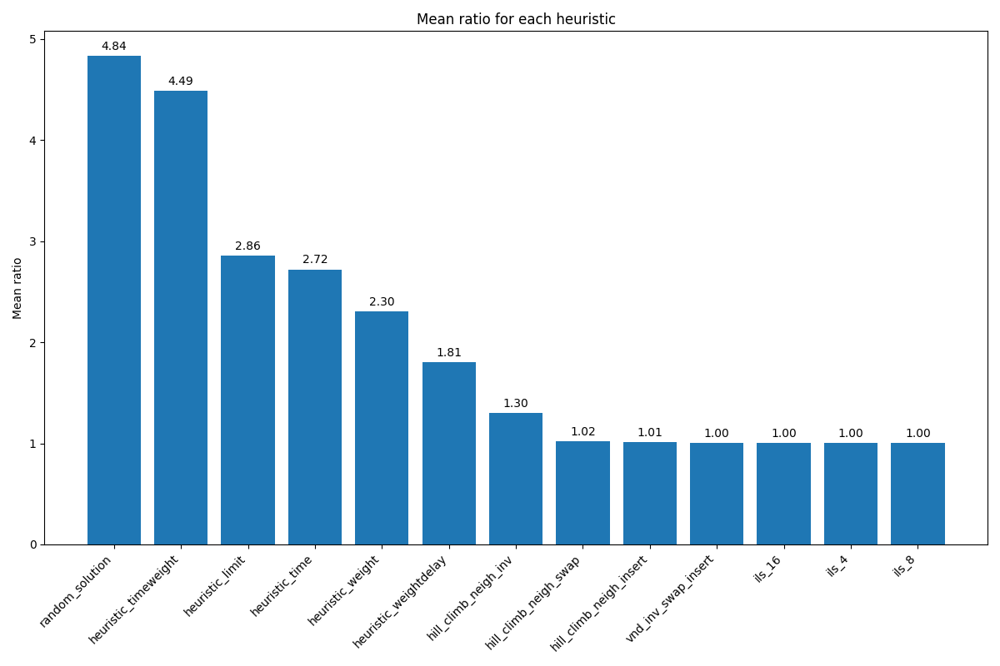
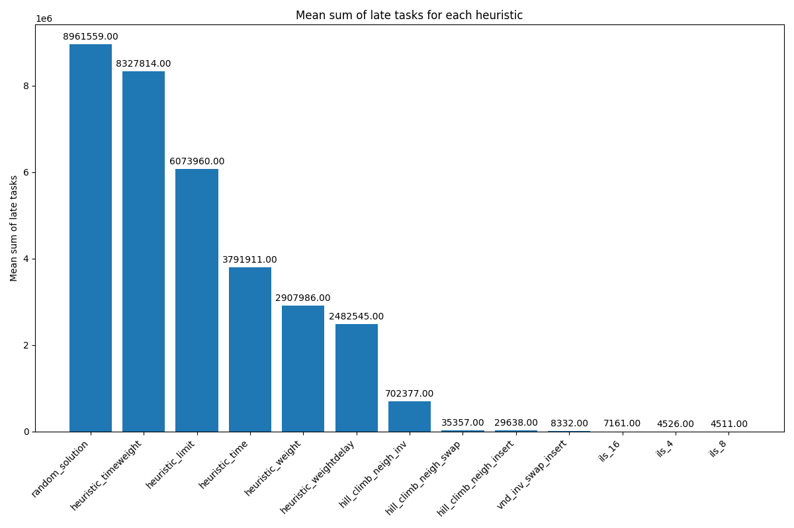

# Rapport TP4 ACT

Gaspar Henniaux – Marwane Ouaret

github : (https ://github.com/pargass/ACT-TP/tree/main/tp4)
## Travail préliminaire

# Question 1.0

Nous avons réalisé le projet en Python pour la facilité de programmation.ependant, choisir un langage tel que C rendrait l'exécution des algorithmes, implémentés dans les autres questions, plus rapide.

```

def read_file(fichier):

 with open(fichier, 'r') as f:

 lignes = f.readlines()

 n = int(lignes[0].strip())

 task = []

 for i in range(1, n + 1):

 pi, wi, di = map(int, lignes[i].strip().split())

 task.append((pi, wi, di))


 return task

```

# Question 1.1


```

def late(tache, ordonnance):

 temps_actuel = 0

 retard = 0

 Pour chaque el in ordonnance: #parcours l'ordonnenancement pour savoir quelle taches exectué.

 Cj += temps d'execution de la tache[el]

 temps_apres_delay = max(temps_actuel - le delais de la tache[el], 0)

 retard += le poids de la tache[el] * temps_apres_delay

 return retard

```

# Question 1.2

Un ordonnancement est un tableau de taille n taches avec des valeurs distinctes allant de 0 à n-1.

```
def random_solution(taches):

 retourne tableau.arrange(len(taches)).shuffle

```

# Question 1.3

Pour cette question, nous avons décidé de faire 3 heuristiques constructives gloutonnes simples basées sur les attributs d'une tâche.

L'heuristique temps donne l'ordonnancement des tâches les plus courtes d'abord, cela permet d'avoir le moins de tâches ayant atteint leurs délais.

L'heuristique poids donne l'ordonnancement des poids les plus lourds d'abord, ainsi les tâches ayant du retard sont celles qui ont un poids moins important.

L'heuristique limite donne l'ordonnancement des retards les plus proches d'abord, ainsi on priorise les délais les plus courts.

Ensuite, nous avons implémenté 2 autres heuristiques basées sur des ratios.

L'heuristique temps-poids ordonne les tâches en fonction du ratio temps sur poids. Cela permet de prioriser les temps les plus courts ou les poids les plus importants.

L'heuristique poids/délai ordonne les tâches en fonction du ratio poids sur le délai dans l'ordre décroissant. Cela permet de prioriser les délais les plus courts ou les poids les plus importants.

# Question 1.4

Nous avons implémenté 3 voisinages différents.

Voici l'exemple pour illustrer les voisinages : [1, 2, 3, 4, 5]

Le premier est l'inversion 2 à 2 d'éléments côte à côte.

Ex.: [2, 1, 3, 4, 5], # Échange entre 1 et 2

 [1, 3, 2, 4, 5], # Échange entre 2 et 3

 [1, 2, 4, 3, 5], # Échange entre 3 et 4

 [1, 2, 3, 5, 4] # Échange entre 4 et 5

Le deuxième est basé sur toutes les permutations possibles entre deux éléments.

Ex.: [2, 1, 3, 4, 5], # Échange entre 1 et 2

 [3, 2, 1, 4, 5], # Échange entre 1 et 3

 [4, 2, 3, 1, 5], # Échange entre 1 et 4

 [5, 2, 3, 4, 1],  # Échange entre 1 et 5

 [1, 3, 2, 4, 5], # Échange entre 2 et 3

 [1, 4, 3, 2, 5],  # Échange entre 2 et 4

 [1, 5, 3, 4, 2],  # Échange entre 2 et 5

 [1, 2, 4, 3, 5], # Échange entre 3 et 4

 [1, 2, 5, 4, 3], # Échange entre 3 et 5

 [1, 2, 3, 5, 4] # Échange entre 4 et 5

Le troisième est basé sur le déplacement d'un élément à toutes les positions possibles.

Ex :

 [2, 1, 3, 4, 5], # 1 déplacé après 2

 [2, 3, 1, 4, 5], # 1 déplacé après 3

 [2, 3, 4, 1, 5], # 1 déplacé après 4

 [2, 3, 4, 5, 1], # 1 déplacé après 5


 [2, 1, 3, 4, 5], # 2 déplacé avant 1 (double)

 [1, 3, 2, 4, 5], # 2 déplacé après 3

 [1, 3, 4, 2, 5], # 2 déplacé après 4

 [1, 3, 4, 5, 2], # 2 déplacé après 5


 [3, 1, 2, 4, 5], # 3 déplacé avant 1

 [1, 3, 2, 4, 5], # 3 déplacé avant 2 (double)

 [1, 2, 4, 3, 5], # 3 déplacé après 4

 [1, 2, 4, 5, 3], # 3 déplacé après 5

 etc.

Grâce à ces voisinages, nous avons pu implémenter un HillClimbing prenant en paramètre un voisinage afin de pouvoir tester les différents voisinages. La solution de base est initialisée par un ordonnancement donné par une heuristique.

Nous avons aussi implémenté un VND. Ce dernier test s'exécute sur un ordre de la liste de voisinage que nous avons prédéfinie grâce à des tests. Lorsqu'une solution est améliorée, on retourne au premier voisinage.

# Question 1.5

Dans l'ILS que nous avons implémenté, nous avons défini plusieurs critères :

– Initialisation : ordonnancement mis en paramètre (nous utilisons une heuristique). Cela permet d'avoir un ordonnancement meilleur qu'un ordonnancement aléatoire.

– Recherche locale : nous utilisons VND, ce dernier étant plus efficace que HillClimbing.

– Perturbation : elle permet de diviser notre ordonnancement en k parties et d'échanger aléatoirement 2 segments adjacents. Le fait d'implémenter une perturbation avec un K variable permet de jauger la perturbation pour qu'elle ne soit ni trop importante

– Critère d'acceptation : nous acceptons la solution si cette dernière est meilleure que la précédente.

– Critère d'arrêt : nous bouclons jusqu'à n itérations sans amélioration. Si une amélioration a eu lieu, elle est réinitialisée à 0.

# Question 1.6

Soit un test effectué avec le fichier n100_15_b.txt, le but est de comparer les différentes méthodes.
Le score optimal de ce test étant 172995.

Nous avons utilisé l'heuristique weightdelay et testé différents ILS en modifiant la valeur k de la perturbation.

Le score de VND étant de 173020

Pour k = 8, score = 173020.
Pour k = 6, score = 173020.
Pour k = 4, score = 172995.
Pour k = 3, score = 173020.
Pour k = 2, score = 173020.

On peut en déduire que la meilleure perturbation est k = 4 sur cet exemple. Cette dernière variable a permis à l'ILS de trouver l'optimal.

Sur les 20 tests effectués, lorsque k = 8, nous avons trouvé 6 optimaux. Tandis que pour k = 4, nous avons trouvé 8 optimaux.

# Question 1.7





En observant le graphique des ratios, on voit que les heuristiques ont du mal à se rapprocher de l'optimal. La performance d'hilclimbing dépend du voisinaege utilisé, insert est le plus performant et se rapproche vraiment de l'optimal. Les autres voisinaege sont moins performants. vnd est plus performant que hillclimbing mais reste moins performant que ILS. ILS est le plus performant et se rapproche le plus de l'optimal, VND et ILS ont des ratios à 1.

En se penchant sur le graphique des différences, on peut voir plus précisement les performances des algorithmes. On peut notamment voir que bien que les différentes versions d'ILS soient très proches, la version avec k = 8 a une somme de latence moins élevée que les autres. Il faut donc un compromis entre la performance globale et les optimaux trouvés.


